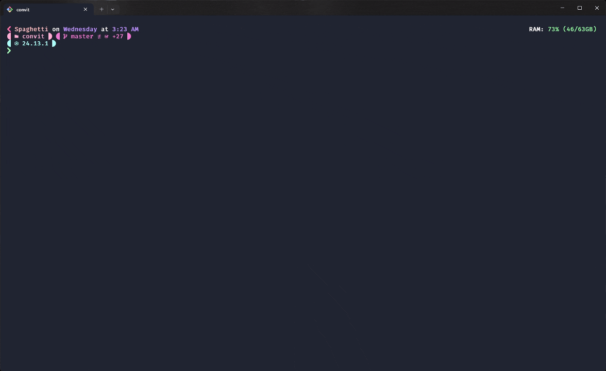

# convit

Most AI commit tools are `git diff | ask GPT`. They produce `fix: update stuff` and call it a day.

convit is different by design. Before a single token reaches the model, the codebase runs a complete pre-analysis pass. It votes on the commit type. It scores every file by importance. It scans for secrets. It compresses the diff down to pure signal. The model receives context that is already half-analyzed. That is why the output is different.



---

## Why

Generic GPT wrappers hand the model a raw diff and a template. The model has no idea what matters. It guesses. It produces output that is technically formatted but semantically empty.

The Pre-Analysis Intelligence Layer runs first. It classifies every file by category, computes importance scores, casts weighted votes on type and scope, and strips generated noise before the prompt is even assembled. The model does not guess. It gets a hint derived from the actual structure of your change.

The model should reason about your intent, not your lockfile.

---

## [SECURE] Mode

convit is local-first by default.

Out of the box, it talks to `http://localhost:1234/v1`. No configuration. No API key. No account. Open LM Studio, load a model, run `npx @kareem-aez/convit`. Your diff never leaves the machine.

When convit detects `localhost` or `127.0.0.1`, the `[SECURE]` badge appears in the terminal on every generation. The cost line reads `Free (local & private)`. That is not a fallback state. It is the intended default.

```bash
# start LM Studio, load a model, then:
npx @kareem-aez/convit
```

This works identically with Ollama:

```
CONVIT_URL=http://localhost:11434/v1
```

Before any generation runs, the raw diff is scanned against eight sensitive data patterns on your local machine. The scan happens before the prompt is built, before any network call, regardless of which provider you use.

| Pattern | What it catches |
|---|---|
| `ghp_[A-Za-z0-9]{36}` | GitHub personal access tokens |
| `sk-[A-Za-z0-9]{48}` | OpenAI API keys |
| `AKIA[0-9A-Z]{16}` | AWS access keys |
| `-----BEGIN ... PRIVATE KEY-----` | RSA / OPENSSH private keys |
| `api_key = "..."` (20+ chars) | Generic API key assignments |
| `password = "..."` (8+ chars) | Password assignments |
| `secret = "..."` (20+ chars) | Secret assignments |
| `token = "..."` (20+ chars) | Token assignments |

Matched values are masked to `first4****last4` in the display. The confirmation prompt defaults to cancel. Secrets do not leave silently.

Using `--accept` for CI automation? Any sensitive match is a hard block. The run stops.

---

## The Weighted Voting Engine

### Type Detection

Every file independently casts votes based on what it is and what happened to it. The type with the highest accumulated score wins.

| Signal | Vote |
|---|---|
| Test file touched | +5 `test` |
| Docs file touched | +5 `docs` |
| Config file touched | +4 `chore` |
| File renamed | +3 `refactor` |
| Diff contains `useMemo` / `cache` / `optimize` | +3 `perf` |
| New source file added | +2 `feat` |
| Existing source file modified | +2 `fix` |
| Diff contains `catch` / `error` / `try` | +2 `fix` |

This is additive, not a decision tree. Touch three test files and two source files: test accumulates 15 points to fix's 4. Test wins. Modify a source file that also introduces error handling: fix gets 4 combined points. It is right. Multiple weak signals compound into a confident classification.

Confidence is reported next to the type: `high` (score >= 10), `medium` (>= 5), `low` (< 5). You know how certain the analysis is before the model starts.

### Scope Detection

Scope candidates compete by accumulated weight across all staged files. Highest weight wins.

Built-in defaults:

| Pattern | Scope | Weight |
|---|---|---|
| `packages/([^/]+)/.*` | package name | 10 |
| `src/([^/]+)/.*` | directory name | 8 |
| `components/.*` | ui | 5 |

User patterns in `.convitrc` run before the defaults. Configure `src/features/([^/]+)/.*` at weight 10 and feature-sliced scopes beat generic directory names. Touch five files across three layers and the deepest, most specific scope takes the commit. No tiebreaker ambiguity.

`$1` in the scope string injects the first capture group. The scope is derived, not hardcoded.

---

## Surgical Compression

Raw diffs are noisy. A 300-line feature can arrive padded with 2,000 lines of context, whitespace, and boilerplate. Feeding that to the model wastes the context window on content that carries no signal.

Below 10,000 characters, the diff passes through unchanged. The model gets full context for small changesets.

Above 10,000 characters, compression activates. The parser runs a structured extraction:

1. Files are grouped by semantic category: source first, generated last.
2. Within each file, key changes are extracted using AST-lite pattern matching. Function declarations, class definitions, exported constants, type definitions, TODO and FIXME annotations are kept. Import statements are explicitly skipped. They carry no semantic signal.
3. The output is a compact structured summary with category headers, file paths, change stats, and up to five key-change bullets per file.

A 45,000-character diff becomes 4,000 characters. The model still sees what matters.

The CLI shows the math every time:

```
Compressed 89% · 45,321 → 4,891 chars · ~11.3k → ~1.2k tokens
```

Hard ceiling at 100,000 characters on the final prompt input. `--no-compress` bypasses everything for when you need the raw view.

---

## The Audit Trail

```bash
convit --debug
```

Every decision is visible. No black boxes.

The debug output exposes the full system prompt and user prompt before they reach the model. The complete DiffSummary with per-file category, importance score, additions, and deletions. The classification scorecard showing every vote, which rules fired, which files triggered them, and the winner. Compression stats. Config details including URL, model, dry-run state, and estimated input tokens.

The scorecard format:

```
  • test     (15): +5 from auth.test.ts, +5 from profile.test.ts, +5 from session.test.ts  ←
  • fix      (4):  +2 from api/auth.ts, +2 from diff: error/catch
  • chore    (3):  +3 from 1 config files
  Winner: test (15/22 total votes)
  Primary scope: auth (via src/features/auth/handler.ts)
```

You can see exactly why the analysis landed where it did. If it is wrong, you know which rule to tune. The voting is transparent by design.

---

## The Correction Loop

When a generated message fails validation and you hit Regenerate, convit does not retry with the same prompt. That is how you get the same wrong answer twice.

Instead, it builds a structured `CorrectionHint[]` array. Each hint has a severity (`must_fix` or `should_fix`), a description of exactly what broke, and a concrete suggestion for fixing it.

`must_fix` hints go into the next prompt immediately. `should_fix` hints escalate after the first failed attempt. Temperature increases with each retry: 0.2, then 0.3, then 0.4. The model's search space expands without losing structure.

The model receives a targeted correction block. Not "please try again." Exactly which rule it violated. Exactly what the fix looks like.

After three attempts, Regenerate is removed from the menu. If the model cannot land a valid commit in three rounds with explicit correction hints, you get Accept, Edit, or Cancel. No infinite loops. No pretending a broken retry is useful.

---

## The First Commit

Most tools break on a repo with no commits. convit detects it and handles it correctly.

`isInitialCommit()` runs `git rev-list --count HEAD`. On a fresh repo, git throws a fatal error. convit catches it, returns `true`, and switches the entire prompt into initial-commit mode. The tool does not crash. It does not warn you about the git errors printed to stdout. It just works.

In initial-commit mode, the prompt changes completely:

- The file-level type and scope votes are explicitly suppressed. The model is told to ignore them.
- Instead of "these are incremental changes to X," the model is instructed to describe what the project **is** and what it does.
- The type is constrained to `feat` or `chore`. `fix` is blocked. Nothing is being fixed on a first commit.

Surgical compression still fires on the full staged set. A 26-file initial commit with 134,398 characters of diff compresses to 6,020 characters. That is 96% reduction, ~33.6k tokens down to ~1.5k, before the model sees anything.

The result:

```
feat(convit): initialize ai-driven conventional commit cli

- provide ai-driven conventional commit generation from staged diffs
- support config via .convitrc.json with presets and cost settings
- include security checks for sensitive data in diffs
- calculate token usage and cost for transparency
- modular architecture with cli, core parsing, llm prompts, utils
```

```
Tokens  2.4k in + 1.1k out = 3.5k total
Time    26.46s
Cost    ✨ Free (local & private)

Format validation passed
```

That is not a file list. That is a project description. The model understood what it was looking at because the prompt told it the right question to answer.

The model was `openai/gpt-oss-20b`. Running locally in LM Studio with reasoning set to medium. $0.00. The message it was compared against was generated by Cursor's cloud-backed AI:

```
Initialize convit project with essential configuration files, including .convitrc.json, .env.example,
.gitignore, LICENSE, package.json, and README.md. Set up TypeScript configuration and build process
with tsup. Implement interactive CLI for commit generation and configuration setup. Add type definitions
and core functionality for commit analysis and generation.
```

No conventional commits format. No scope. File names as content. Three sentences of prose where a subject line should be.

The local model won. Not because it is smarter. Because it had the right context and was asked the right question.

---

## Installation

```bash
# zero install, run once
npx @kareem-aez/convit

# project-local (recommended)
npm install -D @kareem-aez/convit
```

Add to `package.json`:

```json
{
  "scripts": {
    "commit": "convit"
  }
}
```

---

## Setup

**LM Studio (default):** Open LM Studio, load a model, run `npx @kareem-aez/convit`. Zero config. Auto-detects the loaded model from `/v1/models` with a 1-second timeout. Code never leaves the machine. `[SECURE]` mode is active automatically.

**Cloud APIs:** Copy `.env.example` to `.env`:

```
CONVIT_URL=https://api.openai.com/v1
CONVIT_KEY=sk-...
CONVIT_MODEL=gpt-4o
```

Works with OpenAI, Google Gemini, Anthropic, OpenRouter, AI Gateway, Groq, or any OpenAI-compatible endpoint. Only three things change: the URL, the API key, and the model name. Same tool. Same prompts. For Gemini, the URL must end with `/openai`. Secrets stay in `.env`. Config files are safe to commit.

**Ollama:** `CONVIT_URL=http://localhost:11434/v1`. `[SECURE]` mode. No API key required.

**Project config:** `npx @kareem-aez/convit init` runs a setup wizard and writes a `.convitrc.json` tuned to your project structure. Scope patterns, file exclusions, and format rules are all configurable.

Config precedence: `--model` flag > env vars > `.convitrc` > built-in defaults.

---

## Commands

```
convit                  interactive commit workflow
convit init             setup wizard, writes .convitrc.json
convit --accept         auto-accept first valid message (CI / automation)
convit --debug          print prompt, DiffSummary, classification, full scorecard
convit --dry-run        generate without committing
convit --model <id>     override model for this run
convit --no-compress    send raw diff, bypass summarization
```

Interactive loop: accept, regenerate, edit, or cancel.

---

## Configuration Reference

Secrets go in `.env` only: `CONVIT_URL`, `CONVIT_KEY`, `CONVIT_MODEL`. Optional: `CONVIT_TIMEOUT` (ms), `CONVIT_INPUT_COST`, `CONVIT_OUTPUT_COST` for cost tracking.

```json
{
  "rules": {
    "maxSubjectLength": 50,
    "maxBulletLength": 72,
    "minBullets": 1,
    "temperature": 0.2,
    "timeout": 60000
  },
  "scopePatterns": [
    { "pattern": "src/features/([^/]+)/.*", "scope": "$1", "weight": 10 },
    { "pattern": "packages/([^/]+)/.*",     "scope": "$1", "weight": 10 },
    { "pattern": "src/([^/]+)/.*",          "scope": "$1", "weight": 8  }
  ],
  "exclude": [
    "src/generated/prisma"
  ]
}
```

`scopePatterns` are regex strings. `$1` injects the first capture group. User patterns always run before built-in defaults. Higher `weight` wins when multiple patterns compete over the same changeset.

---

## What This Is Really About

A commit message is not a description of what changed. Git already has that.

A commit message is the reason. The design decision. The constraint you hit. The tradeoff you made. It is the last act of code review, written for the engineer who reads `git blame` six months from now.

Tools that generate `fix: update stuff` are not saving you time. They are producing noise that looks like signal and training your team to ignore the log entirely.

convit is built on the assumption that you care enough to commit the why. The whole pipeline exists to get the model close enough that you only need to accept or tweak, not rewrite from scratch.

Your commits are part of the codebase. Treat them like it.

---

## License

MIT - Kareem Ahmed
